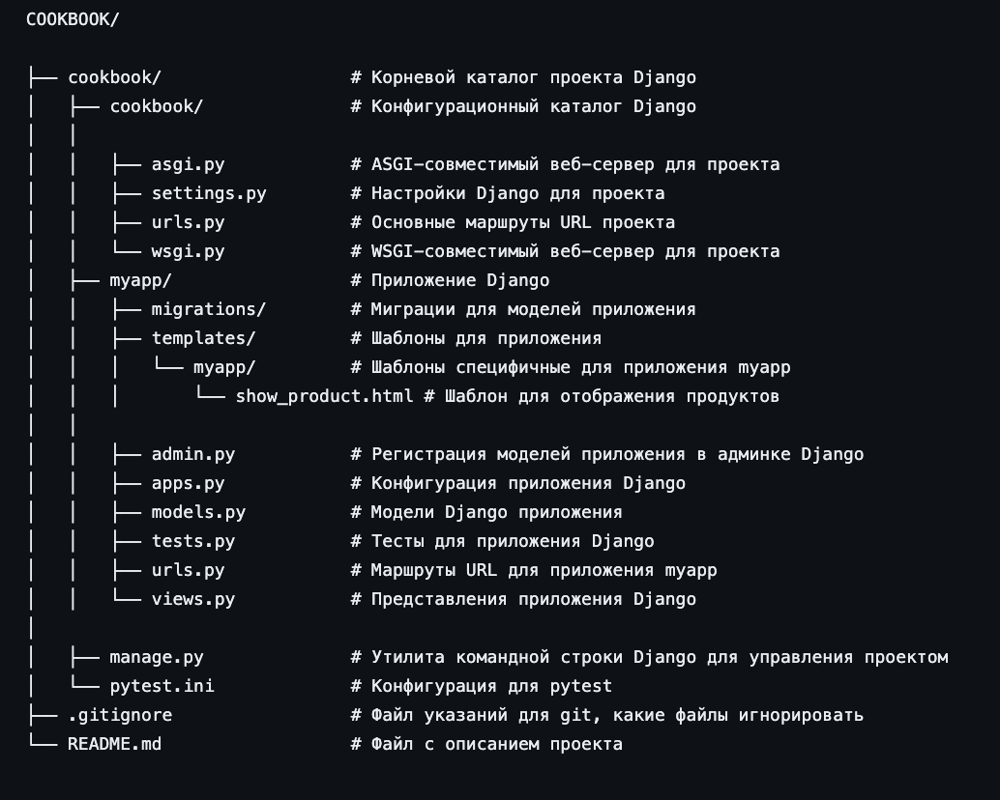

 # COOKBOOK

*COOKBOOK* - это веб-приложение для управления кулинарными рецептами. Оно позволяет пользователям добавлять продукты и рецепты, а также отслеживать использование продуктов в рецептах. Приложение предоставляет функциональность для:

- Добавления продуктов в рецепты с указанием веса.
- Приготовления рецептов с автоматическим увеличением счетчика использования продуктов.
- Просмотра рецептов, в которых не используется конкретный продукт или используется менее 10 грамм этого продукта.
- Управления данными через административный интерфейс Django.


## Структура проекта



## Инструкция по запуску:
1. Установка зависимостей:
Убедитесь, что у вас установлен Python и все необходимые зависимости. Если в корне проекта есть файл requirements.txt, установите зависимости, используя следующую команду:

```sh
pip install -r requirements.txt

```
2. Настройка базы данных:
Выполните миграции для настройки базы данных с помощью команд:

```sh
python manage.py makemigrations
python manage.py migrate

```

3. Создание суперпользователя:
```sh
python manage.py createsuperuser

```

4. Запуск сервера разработки:

```sh
python manage.py runserver

```

После запуска сервера, приложение будет доступно по адресу http://localhost:8000/.

5. Использование приложения:

Посетите http://localhost:8000/admin/ для входа в административный интерфейс и управления продуктами и рецептами.

## Инструкция по использованию приложения:

- Добавление продукта в рецепт:
Отправьте GET-запрос на http://localhost:8000/myapp/add_product_to_recipe/<recipe_id>/<product_id>/<weight>/, заменив <recipe_id>, <product_id>, <weight> на соответствующие значения.

- Приготовление рецепта:
Отправьте GET-запрос на http://localhost:8000/myapp/cook_recipe/<recipe_id>/, заменив <recipe_id> на ID желаемого рецепта.

- Просмотр рецептов без определенного продукта:
Отправьте GET-запрос на http://localhost:8000/myapp/show_recipes_without_product/ для получения списка рецептов, удовлетворяющих критериям.


